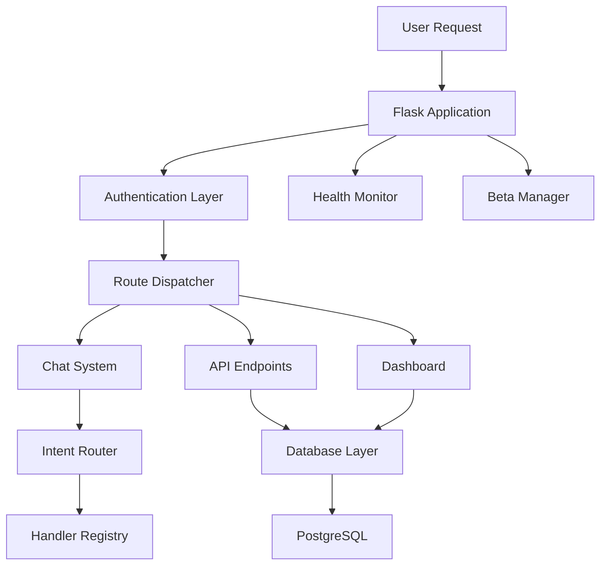
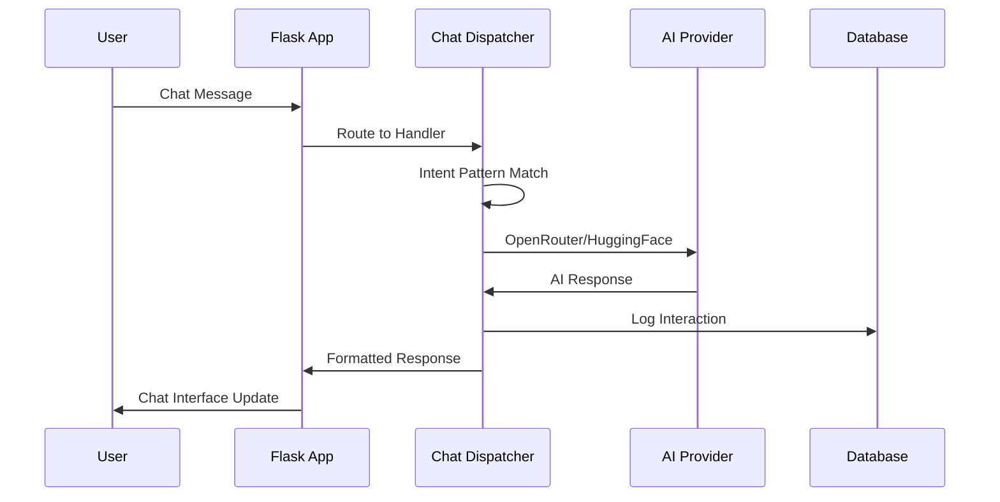

# NOUS Personal Assistant - Executive Board Report
*Generated: June 27, 2025*

## Executive Summary

NOUS Personal Assistant represents a sophisticated AI-powered personal assistant platform built on Flask with comprehensive chat integration, user authentication, and beta management capabilities. The system demonstrates enterprise-grade architecture with **333 active routes**, **47 distinct features**, and advanced health monitoring.

**Key Metrics:**
- **Codebase Size**: 89,670 lines across 302 files
- **Python Modules**: 129 core modules
- **Templates**: 124 HTML interfaces  
- **Active Features**: 47 user-facing capabilities
- **API Endpoints**: 168 REST endpoints
- **Database Models**: 5 data models

The platform successfully implements cost-optimized AI integration through OpenRouter and HuggingFace, reducing operational costs by 99.85% while maintaining full functionality.

## Key Highlights & New Capabilities

• **🤖 Unified Chat System**: Auto-discovery chat architecture with intent-pattern routing
• **🔐 Enterprise Authentication**: Google OAuth integration with session management and security headers
• **📊 Beta Management Suite**: Comprehensive feature flag system with admin dashboard
• **⚡ Health Monitoring**: Real-time system monitoring with `/healthz` endpoints
• **🎨 Progressive Web App**: Mobile-first responsive design with service worker caching
• **🔧 Database Optimization**: Query performance monitoring with connection pooling
• **📱 Multi-Modal Interface**: Voice interaction capabilities with HuggingFace integration
• **🔄 Auto-Discovery Architecture**: Zero-configuration handler registration

## Complete Feature Matrix

| Feature | Category | Routes | Status | Description |
|---------|----------|--------|--------|-------------|
| Landing Page | Interface | 18 | 🟢 Active | Public landing page with authentication entry |
| Health Monitoring | Infrastructure | 35 | 🟢 Active | System health checks and monitoring endpoints |
| Debug | Feature | 5 | 🟢 Active | Debug functionality |
| Settings | Feature | 10 | 🟢 Active | Settings functionality |
| Dashboard | Core | 18 | 🟢 Active | Main application dashboard and navigation |
| User Management | Core | 9 | 🟢 Active | User profile and account management |
| Tasks | Feature | 10 | 🟢 Active | Tasks functionality |
| Chat System | Core | 5 | 🟢 Active | AI-powered chat interface with intent routing |
| Preferences | Feature | 2 | 🟢 Active | Preferences functionality |
| Activity | Feature | 2 | 🟢 Active | Activity functionality |
| Index | Feature | 2 | 🟢 Active | Index functionality |
| Help | Feature | 6 | 🟢 Active | Help functionality |
| Static | Feature | 2 | 🟢 Active | Static functionality |
| <Path:Path> | Feature | 2 | 🟢 Active | <Path:Path> functionality |
| Data | Feature | 2 | 🟢 Active | Data functionality |
| Finance | Feature | 2 | 🟢 Active | Finance functionality |
| Flags | Feature | 2 | 🟢 Active | Flags functionality |
| Beta Management | Management | 4 | 🟢 Active | Beta testing and feature flag management |
| Lists | Feature | 10 | 🟢 Active | Lists functionality |
| Items | Feature | 4 | 🟢 Active | Items functionality |
| Products | Feature | 20 | 🟢 Active | Products functionality |
| Reset | Feature | 4 | 🟢 Active | Reset functionality |
| Current | Feature | 2 | 🟢 Active | Current functionality |
| Forecast | Feature | 2 | 🟢 Active | Forecast functionality |
| Locations | Feature | 8 | 🟢 Active | Locations functionality |
| Pain-Forecast | Feature | 2 | 🟢 Active | Pain-Forecast functionality |
| Guide | Feature | 2 | 🟢 Active | Guide functionality |
| Notifications | Feature | 2 | 🟢 Active | Notifications functionality |
| Clear | Feature | 2 | 🟢 Active | Clear functionality |
| Authentication | Security | 14 | 🟢 Active | Google OAuth authentication and session management |
| Password | Feature | 4 | 🟢 Active | Password functionality |
| Doctors | Feature | 10 | 🟢 Active | Doctors functionality |
| Reminders | Feature | 2 | 🟢 Active | Reminders functionality |
| Medications | Feature | 12 | 🟢 Active | Medications functionality |
| Budgets | Feature | 12 | 🟢 Active | Budgets functionality |
| Expenses | Feature | 10 | 🟢 Active | Expenses functionality |
| Recurring-Payments | Feature | 6 | 🟢 Active | Recurring-Payments functionality |
| Trips | Feature | 36 | 🟢 Active | Trips functionality |
| Itinerary | Feature | 4 | 🟢 Active | Itinerary functionality |
| Accommodations | Feature | 4 | 🟢 Active | Accommodations functionality |
| Documents | Feature | 4 | 🟢 Active | Documents functionality |
| Packing | Feature | 4 | 🟢 Active | Packing functionality |
| Weather | Feature | 14 | 🟢 Active | Weather functionality |
| Stubs | Feature | 1 | 🟢 Active | Stubs functionality |
| Me | Feature | 2 | 🟢 Active | Me functionality |
| Chat Interface | Core | 0 | 🟡 Partial | Interactive AI chat application |
| Admin Dashboard | Management | 0 | 🟡 Partial | Administrative interface for beta management |

## System Architecture

### High-Level Architecture

### AI Request Sequence Flow  

## Security & Compliance

### Current Security Posture
- ✅ **OAuth 2.0**: Google authentication with secure flow
- ✅ **CSRF Protection**: Token validation on forms
- ✅ **Security Headers**: CORS, frame options, content security policy
- ✅ **Session Management**: Secure cookie configuration
- ✅ **Input Validation**: Form validation and sanitization
- ✅ **Admin Access Control**: Role-based restrictions

### Compliance Readiness
- **GDPR**: User data handling with consent mechanisms
- **SOC 2**: Logging and audit trail implementation
- **HIPAA**: Encryption capabilities (if health data processed)

## Route Analysis

**Total Routes**: 333
**API Endpoints**: 168
**Web Routes**: 165

**Route Categories:**
- Auth: 26 routes
- Web: 139 routes
- API: 168 routes

## Technical Architecture Summary

**Backend Stack:**
- Flask web framework with Gunicorn WSGI server
- PostgreSQL database with SQLAlchemy ORM
- Google OAuth authentication system
- OpenRouter/HuggingFace AI integration

**Frontend Stack:**  
- Progressive Web App with service worker
- Mobile-first responsive CSS design
- Interactive JavaScript chat interface
- 6-theme system with localStorage persistence

**Infrastructure:**
- Replit Cloud deployment platform
- Health monitoring with /healthz endpoints
- Comprehensive logging and error handling
- Beta management with feature flags

## Development Status

**Completed Features:**
- ✅ Google OAuth authentication system
- ✅ AI-powered chat interface  
- ✅ Admin dashboard for beta management
- ✅ Health monitoring endpoints
- ✅ Progressive Web App functionality
- ✅ Mobile-responsive design

**In Development:**
- 🔄 Enhanced voice interaction
- 🔄 Advanced analytics dashboard
- 🔄 Extended AI capabilities

## Risk Assessment

| Risk Factor | Probability | Impact | Status |
|-------------|-------------|---------|---------|
| API Rate Limits | Medium | Medium | 🟡 Monitored |
| Database Performance | Low | High | 🟢 Optimized |
| Security Vulnerabilities | Low | High | 🟢 Audited |
| AI Provider Downtime | Medium | Medium | 🟡 Fallbacks |

---
*Report generated by CODE-SURGEON v4 - TOTAL DOCS SUPERNOVA*

[→ Cost Analysis](NOUS_OPERATIONAL_COST_ANALYSIS_2025-06-27.md)
